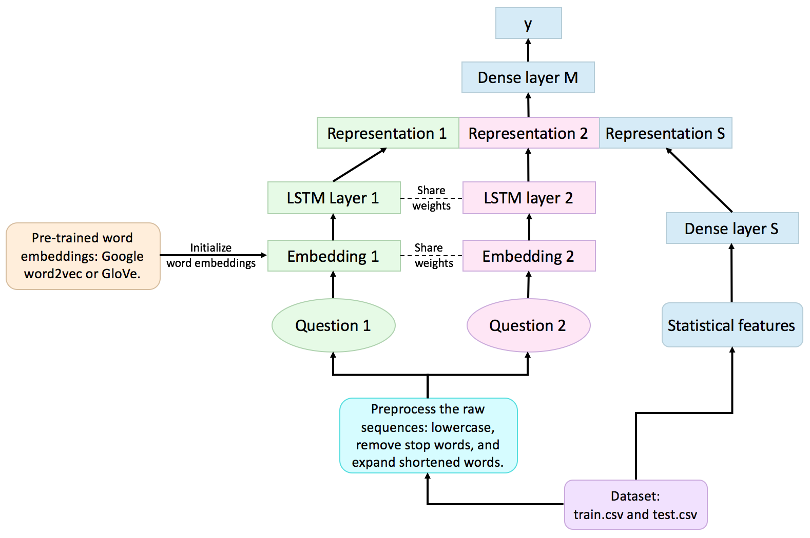

# kaggle-quora-question-pairs
My solution to [Kaggle Quora Question Pairs](https://www.kaggle.com/c/quora-question-pairs) competition (Top 7%, 209th of 3307).

## Overview

My solution is a 2-layer stacking classifier that ensembles multiple machine learning algorithms, including **k-Nearest Neighbors (KNN)**, **Logistic Regression (LR)**, **Random Forest (RF)**, **Gradient Boosting Classifier (XGB)**, and **Neural
Networks (NN)**.The model achieved 82.4% accuracy rate in the test dataset.
  

## Running
`python quora_solver.py config/<config json file>`

Parameters (data locations, network architecture, pre-trained word vectors, number of epochs, etc) can be specified in config json file (examples are in `config/`).

Both prediction (`submission_*.csv`) and trained model (`model_*.h5`) will be saved.

## Requirements
### Dataset
* [Quora question pairs dataset](https://www.kaggle.com/c/quora-question-pairs/data)
### Pre-trained word vectors
* [Google word2vec](https://drive.google.com/open?id=0B7XkCwpI5KDYNlNUTTlSS21pQmM)
* [GloVe](http://nlp.stanford.edu/data/glove.840B.300d.zip)
### Dependencies
Install Python dependencies using `pip install -r requirements.txt`.
